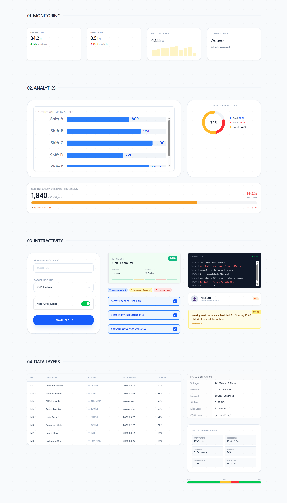

[](https://www.npmjs.com/package/@in-umbra/manufacturing-ui-kit)

<div align="">

# ⚙️ Manufacturing UI Kit
### Precision Engineering for Modern Industrial Dashboards

[](https://opensource.org/licenses/MIT)
[](https://reactjs.org/)
[](https://tailwindcss.com/)
[](https://www.typescriptlang.org/)

**「現場」を、美しく。** Manufacturing UI Kit は、製造業の複雑なデータを直感的なインテリジェンスに変える、  
**In-Umbra Project** による React 専用コンポーネントライブラリです。

</div>

## 🚀 Live Demo (Storybook)

プロジェクトの全コンポーネントをブラウザで確認できます：
[**Storybookを開く**](https://in-umbra.github.io/manufacturing-ui-kit/)

---

## 📸 Component Preview

<a href="https://in-umbra.github.io/manufacturing-ui-kit/" target="_blank">
  
</a>

---

## 🏗 Key Features

- 🛠 **Industrial Grade Components**: 設備稼働状況、KPIカード、製造ログなど、現場に必要なパーツを網羅。
- 📊 **Reactive Analytics**: ドーナツチャートやスパークラインなど、リアルタイムデータに最適化された可視化ツール。
- ⚙️ **High Interactivity**: 現場のミスを防ぐためのステートフルなチェックボックスやデバイススイッチ。
- 🎨 **Blue-Print Design**: 設計図のような美しさと、可視性を両立させたデザインシステム。
- 🛡 **Fully Typed**: TypeScript による堅牢な型定義で、大規模開発でも安心。

---

## 🚀 Getting Started

### 1. Prerequisites

このライブラリは以下の環境を前提としています：
- **React** 18.0+
- **Tailwind CSS** 3.0+
- **Lucide React** (アイコンセット)

### 2. Installation

```bash
npm install @in-umbra/manufacturing-ui-kit
# or
yarn add @in-umbra/manufacturing-ui-kit
```

### 3. Basic Usage

```bash
import { KpiCard, MachineStatusCard, QuickCheck } from '@in-umbra/manufacturing-ui-kit';

const Dashboard = () => {
  return (
    <div className="grid grid-cols-1 md:grid-cols-3 gap-6 p-8 bg-slate-50">
      {/* 効率性の表示 */}
      <KpiCard 
        label="Overall Efficiency" 
        value="84.2" 
        unit="%" 
        trend={{ value: 1.2, isUp: true }} 
      />
      
      {/* 設備の状態確認 */}
      <MachineStatusCard 
        id="NC-202" 
        machineName="CNC Lathe #1" 
        status="running" 
        uptime="12:44" 
      />
      
      {/* 現場の安全点検 */}
      <QuickCheck 
        label="Safety Interlock Verified" 
        onCheck={(checked) => console.log("Safety Status:", checked)} 
      />
    </div>
  );
};
```

## 🎨 Component Gallery

| Category | Components |
| :--- | :--- |
| **Monitoring** | KpiCard, UniversalCard, MiniSparkline |
| **Analytics** | BarChart, DonutChart, ProductionProgressBar |
| **Interaction** | DeviceSwitch, QuickCheck, TextField, SelectBox |
| **Data Layers** | DataTable, SpecsTable, MetricsList, DayServiceBar |
| **Feedback** | AlertBar, StatusBadge, NoticeBoard, EventLog |

## 📄 License

This project is licensed under the **MIT License**.  
See the [LICENSE](./LICENSE) file for details.

<div align="center">
<p>Created with Precision by <strong>In-Umbra</strong></p>
<p>© 2026 In-Umbra. All Rights Reserved.</p>
</div>